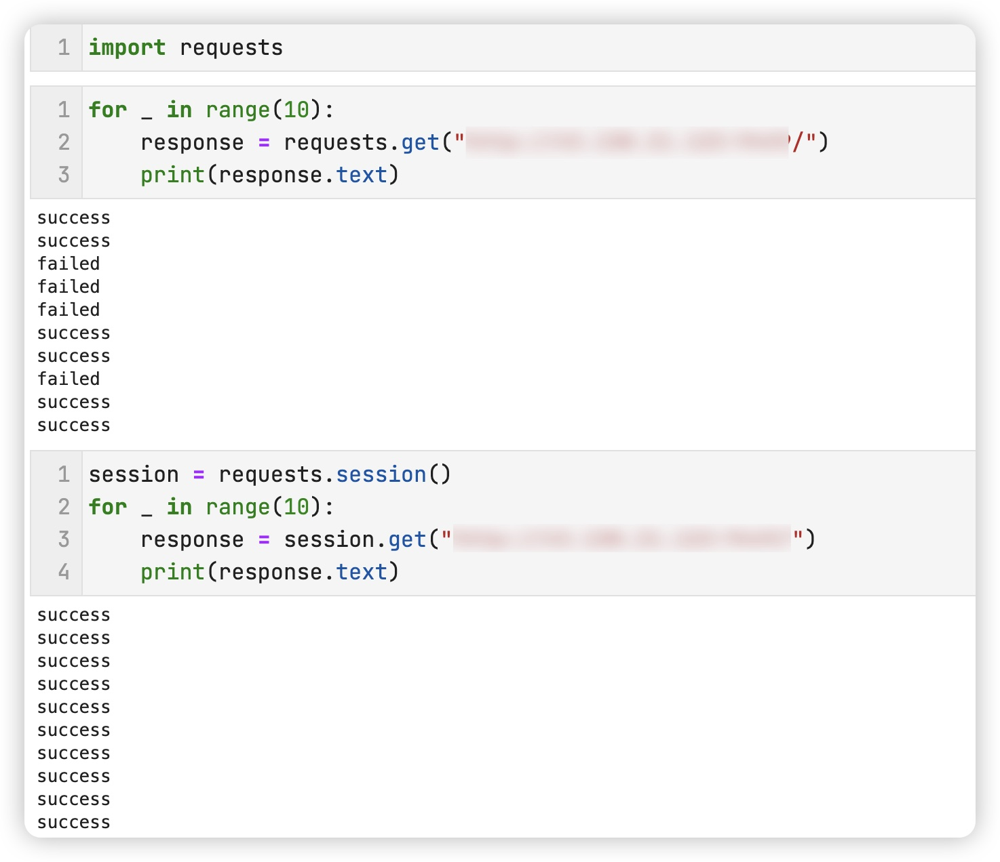

## CASE1: 检测 socket port 的反爬虫

原理:

- 检测 response header 中 connection
    - 若为 keep-alive, 浏览器下次请求会是相同的端口号「一段时间内，与keepalive_timeout有关」
    - 若为 close, 浏览器下次请求会更换端口号


- 服务端随机切换 connection 的值，随后检测下一次请求中 port 是否符合规则来识别爬虫

  


- python requests.get, httpx.get 每次请求都是不同的端口号，可用于识别

- 不适用于 requests.session, httpx.Client，会 follow 上述机制 -_-





### Usage

```
docker build -t case1:0.0.1 .
docker run --rm -p 80:9242 case1:0.0.1
```


