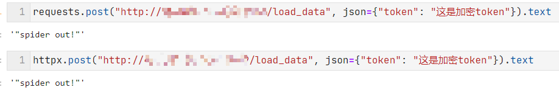
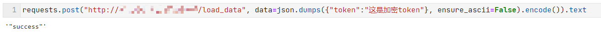

## CASE3: 检测 json编码

### 原理

使用 python 内置 `json.dumps` 序列化时, 会将非ascii字符进行转义[非原样输出]

```python
>>> json.dumps({'token': 'A'})
{"token": "A"}

>>> json.dumps({'token': '🫠'})
{"token": "\\ud83e\\udee0"}

>>> json.dumps({'token': '中文'})
{"token": "\\u4e2d\\u6587"}
```


浏览器中 json序列化函数 `JSON.stringify` 无此机制

```javascript
>>> JSON.stringify({ "token": "🫠" })
{"token":"🫠"}
```


基于此检测 python 系列爬虫 [requests, httpx, ...]




绕过也很简单 `json.dumps` 中设置 `ensure_ascii=False`, 不进行转义, 保持原样输出即可




### 兼容性测试

- js XMLHttpRequest  工作正常

    ```javascript
    var xhr = new XMLHttpRequest()
    xhr.open("POST", "http://localhost/load_data");
    xhr.setRequestHeader("Content-Type", "application/json");
    xhr.send(JSON.stringify({"token": "这是加密token"}));
    xhr.onreadystatechange = function() {
        if (xhr.readyState === 4 && xhr.status === 200) {
            console.log(xhr.responseText)
        }
    }
    ```

    

- js Fetch 工作正常

    ```javascript
    fetch('http://localhost/load_data', {
        method: 'post',
        headers: {
            'Content-Type': 'application/json'
        },
        body: JSON.stringify({ "token": "这是加密token" })
    }).then(resp => resp.text()).then(resp => console.log(resp))
    ```


### Usage

```
docker build -t case3:0.0.1 .
docker run --rm -p 80:9242 case3:0.0.1
```


