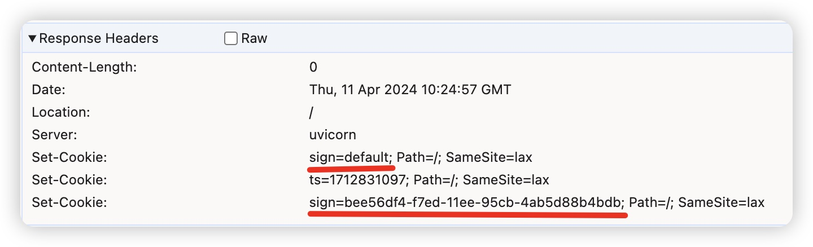
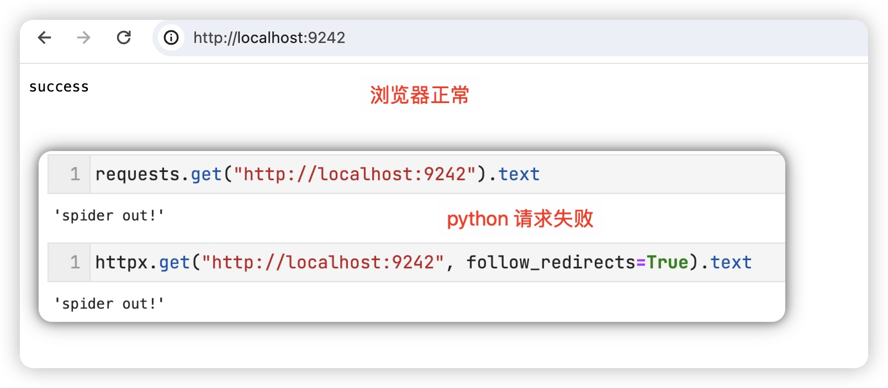

## CASE4: cookie 顺序反爬

### 原理

当包含同名 cookie 时，后设置的会替换到先设置的



但是 Chromiun 内核浏览器 与 Python 中的替换方式不同：

- Chromium 内核浏览器替换方式为：**先删除同名 cookie，后新增**「推测」

  ```
  ts=1712831097; sign=bee56df4-f7ed-11ee-95cb-4ab5d88b4bdb
  ```

- Python 中 `http.cookiejar` 采用字典存储 cookie，替换方式为重新赋值：

  ```python
  cookie["sign"] = "default"
  cookie["ts"] = "1712831097"
  
  cookie["sign"] = "bee56df4-f7ed-11ee-95cb-4ab5d88b4bdb"
  ```

  因此 python 请求时的 cookie 值为：

  ```
  sign=bee56df4-f7ed-11ee-95cb-4ab5d88b4bdb; ts=1712831097 
  ```

基于此，检测 ts, sign 的相对位置来识别爬虫




### 兼容性测试

- PC 端 Chromium 浏览器工作正常


### Usage

```
docker build -t case4:0.0.1 .
docker run --rm -p 80:9242 case4:0.0.1
```


